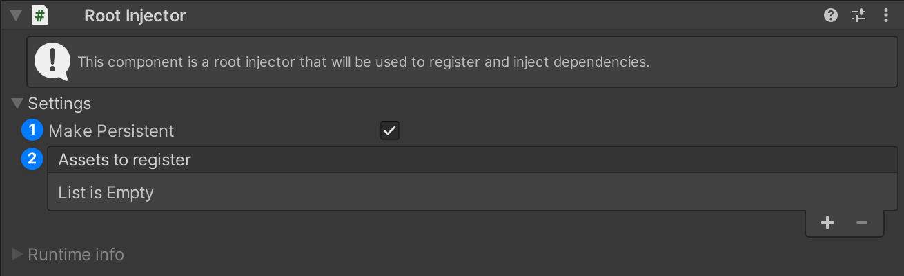
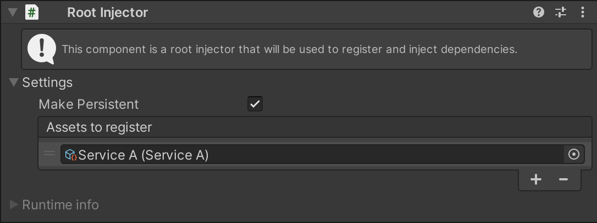
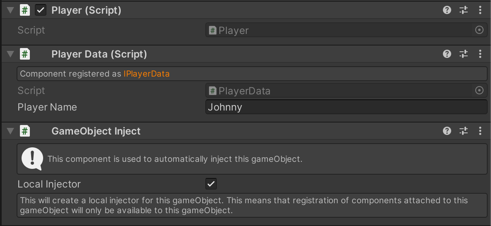
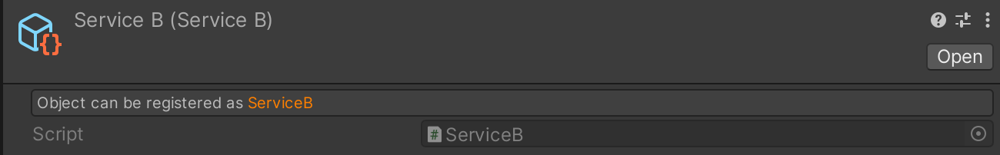
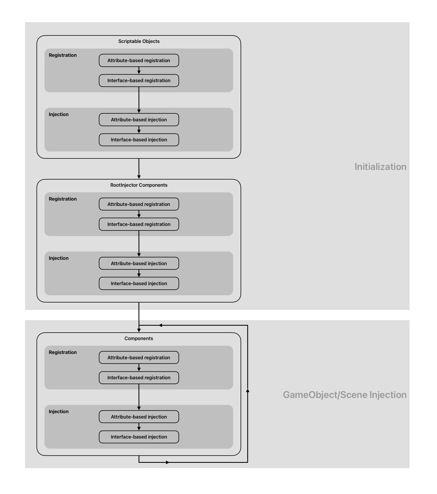

[](https://assetstore.unity.com/publishers/99093)
[](LICENSE)

# SInject
SInject is a dependency injection framework for unity. It is designed to be straightforward to use. 
It is based on the concept of injectors and services. It is designed to be used in a way that is fast to understand and use. 
It also includes a testing framework that makes it easy to write tests for your code. Make sure to check out the samples to see how to use it.

## Installation

You can install SInject via Unity Package Manager. You will find it under `My Assets` section in Unity Package Manager.
If you are using custom assembly definition files, you will need to add `Sapo.DI.Runtime` assembly 
reference to your assembly definition file. If you are not using assembly definition files, you are all set.

## Features
- <span style="color: green">&#10003;</span> Simple and easy to use
- <span style="color: green">&#10003;</span> Supports DI for scenes and prefabs
- <span style="color: green">&#10003;</span> Allows for persistent objects across scenes
- <span style="color: green">&#10003;</span> Supports Components injection
- <span style="color: green">&#10003;</span> Supports Scriptable Objects
- <span style="color: green">&#10003;</span> Supports .net objects
- <span style="color: green">&#10003;</span> Supports circular dependencies
- <span style="color: green">&#10003;</span> Includes testing helpers
- <span style="color: green">&#10003;</span> Support collections

## How to use

-------------

### Setup root injector

To use SInject, we need to create a root injector.
This is the main injector that will be used to inject dependencies into our objects.
In our first scene, right-click in the hierarchy and select `DI/Root Injector`.
> If you don't see the `DI/Root Injector` option, it means that root injector is already set up in the scene.

Now we will see in inspector a Root Injector component.
Root injector is a singleton, so we can only have **one in scene or one across scenes**.


As you can see, there are two sections (`Settings` and `Runtime info`), for now we will focus on the settings section.
There are two options:
1. `Make Persistent` - If this is checked, the root injector will not be destroyed when loading a new scene.
2. `Assets to register` - Here we can drag and drop scriptable objects that we want to register in the injector.
   Most of the time this will be your singleton services, their lifetime will be the same as the root injector's. Please note
   that you can only drag and drop scriptable objects that are defined with `SRegister` attribute.


Now after we have created the root injector, we also need to create `SceneInject` to mark this scene to be injected when loaded.
Right-click in the hierarchy and select `DI/Scene Inject`.
> If you don't see the `DI/Scene Inject` option, it means that scene inject is already set up in the scene.

`Scene Inject` is a component that injects an entire scene when a scene is being loaded. Please note that after a scene is loaded, 
gameObject on which `Scene Inject` is attached will be destroyed.

### Setup a scriptable object service

To inject a scriptable object, we need to define it with `SRegister` attribute.
```csharp
using Sapo.DI.Runtime.Attributes;

[CreateAssetMenu(menuName = "ServiceA")]
[SRegister(typeof(IServiceA))] // This is the interface that we want to inject, we can also use the concrete class
public class ServiceA : ScriptableObject, IServiceA
{
    public void Introduce()
    {
        Debug.Log("Hello, I am ServiceA!");
    }
}
```
Now in unity, create this scriptable object and drag it to the `Assets to register` field in the root injector.

[](Documentation~/service-a.png)

### Set up a Component service

To inject a component, we need to define it with `SRegister` attribute.
```csharp
using Sapo.DI.Runtime.Attributes;

[SRegister(typeof(IServiceB))] // This is the interface that we want to inject, we can also use the concrete class
public class ServiceB : MonoBehaviour, IServiceB
{
    public void Introduce()
    {
        Debug.Log("Hello, I am ServiceB!");
    }
}

```

### Injecting dependencies

With the setup of our root injector and the registration of our scriptable object services, we are now equipped 
to inject our dependencies into various components or other scriptable objects. This allows us to use 
the power of dependency injection, promoting loose coupling and enhancing the modularity and testability of our code.

We can now inject dependencies into components or other scriptable objects.
```csharp
using Sapo.DI.Runtime.Attributes;

public class Player : MonoBehaviour
{
    [SInject] private IServiceA _serviceA;
    [SInject] private IServiceB _serviceB;

    private void Awake()
    {
        _serviceA.Introduce();
        _serviceB.Introduce();
    }
}
```

In this point, we can create a prefab with `Player` script attached to it and when we run the game, we will see in the console:
```   
Hello, I am ServiceA!
Hello, I am ServiceB!
```

### Injecting components

SInject also includes similar attribute `CInject` for injecting components that are attached to the same gameObject.
```csharp
using Sapo.DI.Runtime.Attributes;

public class Player : MonoBehaviour
{
    [CInject] private IServiceB _serviceB;

    private void Awake()
    {
        _serviceB.Introduce();
    }
}
```
This will inject `ServiceB` component that is attached to the same gameObject as `Player` component. 
And the service does not need to be registered in DI

> This will only work if `Scene Inject` is in the scene or `GameObject Inject` is on the player gameObject.

### Spawning prefabs with dependencies

When we want to spawn a prefab and execute injection on it, we need to add `GameObject Inject` on a root object of prefab.
This component will schedule injection on this gameObject and all its children. After injection is done, `GameObject Inject` 
will be destroyed. To add `GameObject Inject` to prefab, click on `Add Component` and search for `GameObject Inject` or 
select `Sapo/DI/GameObject Inject` in a context menu.

In `GameObject Inject` component, we can also see a `Local Injector` toggle. If this is checked, `GameObject Inject` will
create a new injector that will be used only for this gameObject. This is useful when we want to have services that are only
available to specific gameObject. We can register to `Local Injector` both component services and scriptable object services as well.

[](Documentation~/game-object-inject.png)

### Custom Injection

If you want to register or inject dependencies in an own way, you can implement 
`ISInjectorRegisterHandler` and `ISInjectorInjectHandler` interfaces.

```csharp
using Sapo.DI.Runtime.Attributes;
using Sapo.DI.Runtime.Interfaces;

public class Service : MonoBehaviour, IService, ISInjectorRegisterHandler, ISInjectorInjectHandler
{
    [SInject] private ISInjector _injector;
    
    void ISInjectorRegisterHandler.OnRegister(ISInjector injector)
    {
        injector.Register<IService>(this);
    }

    void ISInjectorInjectHandler.OnInject(ISInjector injector)
    {
        // _injector is null
        injector.Inject(this);
        // _injector is injector
    }
    
    private void OnDestroy()
    {
        _injector.Unregister<IService>(this);
    }
}
```

### Collection Injection

SInject supports collection injection, allowing you to register multiple instances of the same type. When resolving a
single instance using Resolve<Instance>(), it returns the first registered instance that is still "alive" (registered
and not destroyed by Unity).

For collection injection, SInject supports three collection types:

- `T[]`
- `List<T>`
- `IEnumerable<T>`

When resolving a collection, SInject guarantees that the collection will contain all currently registered instances at
the time of resolution. However, the order of instances in the collection is not guaranteed. When resolving a collection
with no registered instances, an empty collection will always be returned.

```csharp
using Sapo.DI.Runtime.Attributes;
using Sapo.DI.Runtime.Interfaces;

public class Consumer : MonoBehaviour
{
    [SInject] private IService[] _services;
    [SInject] private ISInjector _injector;
    
    private void Awake()
    {
        foreach (var item in _injector.Resolve<IEnumerable<IItem>>())
        {
            
        }
    }
}
```

### Advanced Injection

SInject provides additional ways to resolve dependencies at runtime. You can resolve types directly through the injector
interface:

- Resolve single instance with `Resolve<T>()`
- Try to resolve with `TryResolve<T>(out T instance)`
- Resolve all instances of a type with collections: `T[]`, `IEnumerable<T>`, `List<T>`
- Resolve instances manually with `ISInjector` interface

Here's an example of using different resolution methods:
```csharp 
using Sapo.DI.Runtime.Attributes;
using Sapo.DI.Runtime.Interfaces;

public class Consumer : MonoBehaviour
{
    [SInject] private ISInjector _injector;
    private IService _service;
    
    private void Awake()
    {
        // if following statement is callend in ISInjectorInjectHandler.OnInject it is equivalent to adding [SInject] to _service field.
        _service = _injector.Resolve<IService>();
    }
}
```

### Custom Editor GUI for Registered Services

If you create a custom Unity editor for a Unity component or ScriptableObject that is defined with the `SRegister` attribute, 
you can manually call `SRegisterGUI.DrawInfo(target)` to draw information about the service. 
This allows you to customize the way the service information is displayed in the Unity editor.

Here's how it looks when no custom editor is used:
[](Documentation~/register-info-gui.png)

Here's an example of how you can use `SRegisterGUI.DrawInfo(target)` in your custom editor:
```csharp
using UnityEditor;
using UnityEngine;

[CustomEditor(typeof(MyComponent))]
public class MyComponentEditor : UnityEditor.Editor
{
    public override void OnInspectorGUI()
    {
        SRegisterGUI.DrawInfo(target);
        DrawDefaultInspector();
    }
}
```

This will draw the service information at the top of the inspector for `MyComponent`, followed by the default inspector.
> Please note that if you are using custom assembly definition files, you will need to add `Sapo.DI.Editor` assembly 

### Testing

SInject includes a testing framework to help you write unit tests for your game code. While testing games can be
challenging, having proper testing tools is essential for maintaining code quality and reliability. The main benefit of
using SInject is that it promotes writing more code-driven solutions rather than relying solely on dragging objects in
the Unity editor, which improves testability.

Here is a self-explanatory example of how to test a component that uses dependency injection.

```csharp
 [TestFixture]
 public class PlayerTests
 {
     private STestGameObjectHelper _gHelper;

     [SetUp]
     public void SetUp()
     {
         _gHelper = new STestGameObjectHelper();
     }
     
     [TearDown]
     public void TearDown()
     {
         _gHelper.Dispose();
     }
     
     [Test]
     public void TakeDamage_With10Damage_ShouldReduceHealthBy10()
     {
         // Arrange
         var playerG = _gHelper.CreateG<Player>();
         var player = playerG.GetComponent<Player>();
         var injector = new STestGamObjectInjector(playerG);
         
         // Mocking the health component
         var health = new Mock<IHealth>();
         health.SetupGet(h => h.Value).Returns(100);
         health.SetupSet(h => h.Value = It.IsAny<int>()).Verifiable();
         
         // Injecting the health component
         injector.Register<IHealth>(health.Object);
         
         // Finally activating player game object
         injector.Activate();
         
         // Act
         player.TakeDamage(10);
         
         // Assert
         health.VerifySet(h => h.Value = 90, Times.Once);
     }
 }
```

> Please note that if you want to use test injector helpers, you will need to add `Sapo.DI.Runtime.Tests` assembly reference to your test assembly definition file.
> For more information about testing, you can check `Testing` sample.

## Samples

You can install samples via Unity Package Manager. Go to `Window/Package Manager`, select `In Project` tab and search for `SInject`.
You will see `Samples` section where you can install samples.

## SInjector

The SInjector class is the main dependency injection container that implements `ISInjector`. This section demonstrates
how to use it as a standalone injector.

### Self-Registration
- Each `SInjector` instance automatically registers itself as `ISInjector`
- It does not register itself as concrete type `SInjector`
- Can be resolved using `Resolve<ISInjector>()`

#### Registration
- Register instances using `Register<T>(instance)` where T is the type to register as
- Multiple instances of the same type can be registered
- Attempting to register a duplicate instance will log an error
- An instance can be registered under multiple types (e.g., both interface and concrete types)

#### Resolution
- `Resolve<T>()` returns the primary (first registered) instance of type T
- `Resolve<T[]>()` returns all registered instances of type T
- Returns `null` if no instances are registered for the requested type


#### Hierarchical Injection
When creating a child injector with `new SInjector(parentInjector)`:
- Child injector maintains its own registrations
- Child injector can access parent's registrations
- Child injector registers itself as `ISInjector`
- Resolution order:
  1. Searches child injector first
  2. Falls back to the parent injector if not found
- Array resolution (`Resolve<T[]>()`) returns unique instances from both child and parent injectors

#### Unregistration
- Use `Unregister<T>(instance)` to remove a registration
- Affects only the injector where the instance was registered
- After unregistration:
   - The next registered instance becomes primary
   - Instance is removed from array resolution results


A behavior-based example:
```csharp
using NUnit.Framework;
using Sapo.DI.Runtime.Core; // SInjector is in Core
using Sapo.DI.Runtime.Interfaces;

// This is called in RootInjector
var rootInjector = new SInjector(); 


// injector registers self as ISInjector
Assert.That(rootInjector.Resolve<ISInjector>(), Is.EqualTo(rootInjector));
// ... however not as SInjector
Assert.That(rootInjector.Resolve<SInjector>(), Is.Null);

// Imagine we have class Service and interface IService

var service1 = new Service();
var service2 = new Service();

// this will register serviceN as IService
rootInjector.Register<IService>(service1);
rootInjector.Register<IService>(service2);

// doing this will log error to Debug
rootInjector.Register<IService>(service2);


// service1 is primary service when resolving `IService`
Assert.That(rootInjector.Resolve<IService>(), Is.EqualTo(service1));

// resolving `IService[]` will contain 2 elements service1 and service 2
Assert.That(rootInjector.Resolve<IService[]>(), Is.EquivalentTo(new [] { service1, service2 }));

// registering service2 as Service
rootInjector.Register<Service>(service2);
// when resolving `Service` will cause resolving service2
Assert.That(rootInjector.Resolve<Service>(), Is.EqualTo(service2));

// This is called in GameObjectInject
var injector = new SInjector(rootInjector);

// injector registers self as ISInjector
Assert.That(injector.Resolve<ISInjector>(), Is.EqualTo(injector));
// rootInjector is still registered
Assert.That(injector.Resolve<ISInjector[]>(), Contains.Item(rootInjector));

// so now primary instances are gathered firstly from `injector`

// service1 is still primary
Assert.That(injector.Resolve<IService>(), Is.EqualTo(service1));

// after doing this the service is registered in `injector`
injector.Register<IService>(service2);

// service2 is now primary
Assert.That(injector.Resolve<IService>(), Is.EqualTo(service1));
// `rootInjector` is untouched
Assert.That(rootInjector.Resolve<IService>(), Is.EqualTo(service1));

// when resolving the collection of services, will contain only unique services
Assert.That(injector.Resolve<IService[]>(), Is.EquivalentTo(new [] { service1, service2 }));

// Register service1 as IService
rootInjector.Unregister<IService>(service1);

// this will affect make service2 primary (as IService) in `rootInjector`
Assert.That(rootInjector.Resolve<IService>(), Is.EqualTo(service2));

// when resolving the collection of services, now will contain only 1 service
Assert.That(rootInjector.Resolve<IService[]>(), Is.EquivalentTo(new [] { service2 }));
Assert.That(injector.Resolve<IService[]>(), Is.EquivalentTo(new [] { service2 }));
```


## Injection Pipeline

> Please keep in mind that this framework is heavily using reflection to register and inject dependencies.
> Also, this framework can have performance peeks when loading huge scenes.

When a scene is loaded or a prefab is spawned, the injection pipeline is executed.

[](Documentation~/injection-pipeline.png)

The initialization phase, which is responsible for registering service assets, is executed only once on the root injector.

## License

This project is licensed under the MIT License—see the [LICENSE](LICENSE) file for details.
